```{r setup, include=FALSE, echo = FALSE, message = FALSE}
knitr::opts_chunk$set(echo=TRUE, warning=FALSE, message=FALSE, dev.args = list(bg = 'transparent'), fig.align='center')
require('tidyverse')
theme_set(theme_bw() + theme(plot.background=element_blank()) )
```

## road map for today

<span style = "color:white"> &nbsp; </span>

- get in touch with R for <span style = "color:firebrick">data wrangling & plotting</span>
    - think about data & its format
    - manipulate data into appropriate format: <span style = "color:firebrick">data wrangling</span>
    - extract <span style = "color:firebrick">data summaries</span> 
    - choose aspects to <span style = "color:firebrick">visualize data</span>
    
<span style = "color:white"> &nbsp; </span>

- look at data set from <span style = "color:firebrick">case study</span> on quantifier <span style = "font-style: italic">some</span>

# R for data science

## R4DS

<div align = 'left' style = "margin-left : 30px">
  
</div>

<div style = "position:absolute; top: 620px; right:60px;">
  freely available online: [R for Data Science](http://r4ds.had.co.nz/)
</div>

## data science?

<div align = 'center'>
  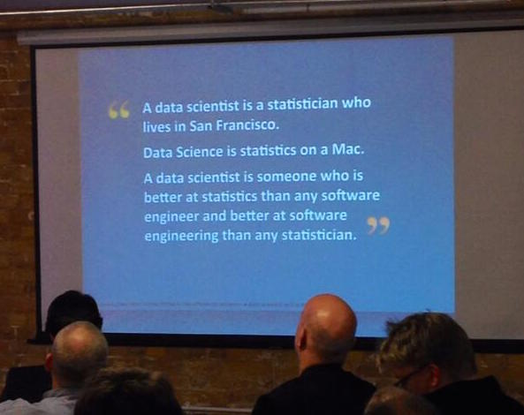
</div>

<div style = "position:absolute; top: 620px; right:60px;">
  read [more](https://priceonomics.com/whats-the-difference-between-data-science-and/)
</div>


## data science?

<span style = "color:white"> &nbsp; </span>

<div align = 'center'>
  
</div>

<div style = "position:absolute; top: 620px; right:60px;">
  from [R for Data Science](http://r4ds.had.co.nz/)
</div>

# R

## what R is (not)

<span style = "color:white"> &nbsp; </span>

special purpose programming language for ~~data science~~ <span style = "color:firebrick">statistical computing</span>

- statistics
- data mining
- data visualization

<span style = "color:white"> &nbsp; </span>

[authority](https://rviews.rstudio.com/2017/02/22/how-to-teach-r-common-mistakes/) says to tell you to 
<span style = "color:firebrick">not think of R as a programming language!</span>

## past & present

<div style = "float:left; width:35%;">
- a trusted old friend from 1993  
- still thriving
</div>
<div style = "float:right; width:60%;">
<div align = 'center'>
  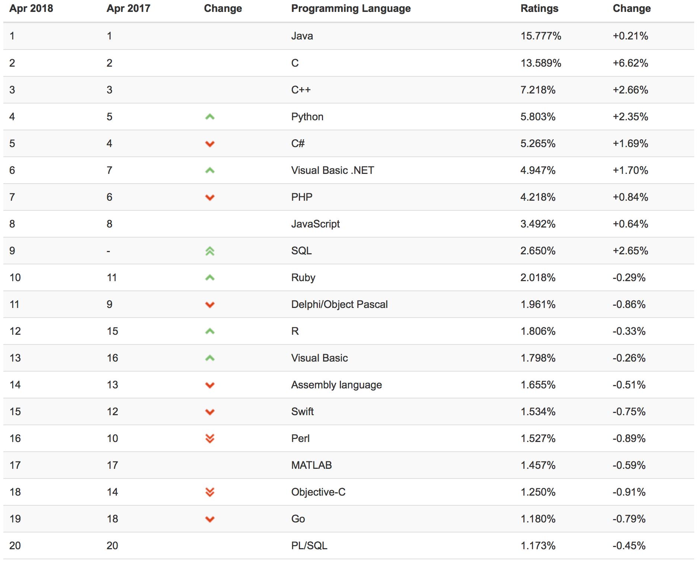
</div>
</div>  

## some basic properties

<div style = "float:left; width:45%;">

- free (GNU General Public License)

- interpreted language

```{r}
6 * 7
```

- vector/matrix based

```{r}
x = c(1,2,3)
x + 1
```


- index start at 1 & column-major mode

```{r}
m = matrix(c(1,2,3,4), nrow = 2)
m[1,]
```

</div>
<div style = "float:right; width:45%;">

- supports object-oriented, procedural & functional style
  
- prefers functional style over loops

```{r, eval = FALSE}
# this is (usually) slow
x = c()
for (i in 1:10000) {
  x[i] = crazyFunction(i)
}

# this is (usually) faster
sapply(1:10000, function(i) crazyFunction(i))
```

- convenient interfaces to other languages

- assignment in both directions possible

```{r}
x <- 3
3 -> y
x == y
```


</div>  

## extensibility & community support

a lot of innovation and development takes place in <span style = "color:firebrick">packages</span>

go browse some 12,000 packages on [CRAN](https://cran.r-project.org/web/packages/)

<span style = "color:white"> &nbsp; </span>

<div style = "float:left; width:45%;">
install packages (only once)

```{r, eval = F}
install.packages('tidyverse')
```
</div>
<div style = "float:right; width:45%;">
load packages (for every session)

```{r, eval = F}
library(tidyverse)
```  
</div>  

## base R & package functions

<span style = "color:white"> &nbsp; </span>

base R functionality is always available

```{r}
rnorm(n = 5, mean = 10) # 5 samples from a normal with mean 10 & std. dev. 1 (default)
```

<span style = "color:white"> &nbsp; </span>

packages bring extra functions

```{r}
library(mvtnorm)
mvtnorm::rmvnorm(n = 3, mean = rep(10,5)) # 3 samples from a multivariate normal
```

## help

<span style = "color:white"> &nbsp; </span>

```{r, eval = F}
help('rmvnorm')
```


    Mvnorm {mvtnorm}	R Documentation
    Multivariate Normal Density and Random Deviates

    Description

    These functions provide the density function and a random number generator
    for the multivariate normal distribution with mean equal to mean and 
    covariance matrix sigma.

    Usage

    dmvnorm(x, mean = rep(0, p), sigma = diag(p), log = FALSE)
    rmvnorm(n, mean = rep(0, nrow(sigma)), sigma = diag(length(mean)),
        method=c("eigen", "svd", "chol"), pre0.9_9994 = FALSE)


## RStudio

integrated development environment for R

<span style = "color:white"> &nbsp; </span>


<div align = 'center'>
  
</div>

# data

## types of data

<span style = "color:white"> &nbsp; </span>

this course will focus (entirely?) on <span style = "color:firebrick">rectangular data</span>

<span style = "color:white"> &nbsp; </span>

not covered:

- image data
- sound data
- video data
- corpora
- ...

## rectangular data

```{r}
library(nycflights13)
nycflights13::flights
```

<div style = "position:absolute; top: 620px; right:60px;">
  study Chapters 5 and 12 from [R for Data Science](http://r4ds.had.co.nz)
</div>

## tidy data

1. each variable is a column
2. each observation is a row
3. each value is a cell

<span style = "color:white"> &nbsp; </span>

<div align = 'center'>
  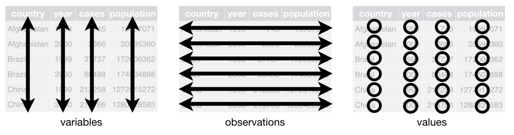
</div>

## untidy data 1

this is untidy

```{r}
grades = tibble(name = c('Michael', 'Noa', 'Obioma'),
                midterm = c(3.7, 1.0, 1.3),
                final = c(4.0, 1.3, 1.0))
grades
```

<span style = "color:white"> &nbsp; </span>

to tidy up, we need to <span style = "color:firebrick">gather</span> columns which are not variables into a new column

```{r}
grades %>% gather('midterm', 'final', key = 'exam', value = 'grade')
```

## untidy data 2

this is untidy too

```{r}
results = tibble(name = c('Michael', 'Noa', 'Obioma', 'Michael', 'Noa', 'Obioma'),
                 what = rep(c('grade', 'points'), each = 3),
                 howmuch = c(3.7, 1.0, 1.0, 55, 99, 99))
results
```

<span style = "color:white"> &nbsp; </span>

to tidy up, we need to <span style = "color:firebrick">spread</span> cells from a row out over several columns

```{r}
results %>% spread(key = 'what', value = 'howmuch')
```

# tidyverse

## overview

<span style = "color:white"> &nbsp; </span>

<div align = 'center'>
  
</div>

<div style = "position:absolute; top: 620px; right:60px;">
  [tidyverse website](https://www.tidyverse.org)
</div>

# case study

## truth-value judgement task 

<div align = 'center'>
  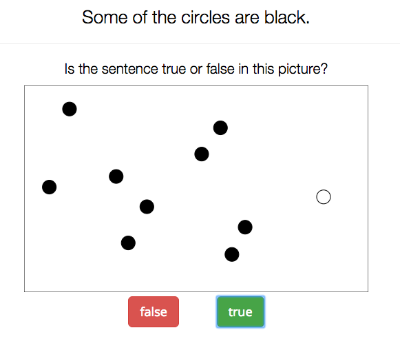
</div>

## test your intuitions

"Some of the circles are black."

<div align = 'left'>
  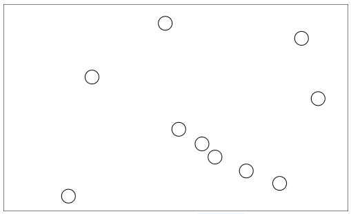
  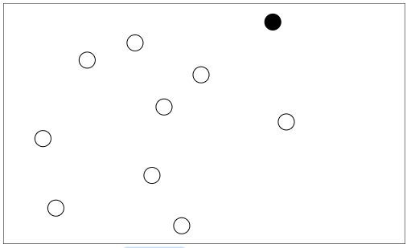
  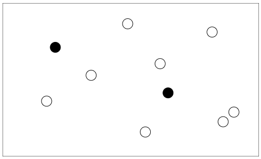
  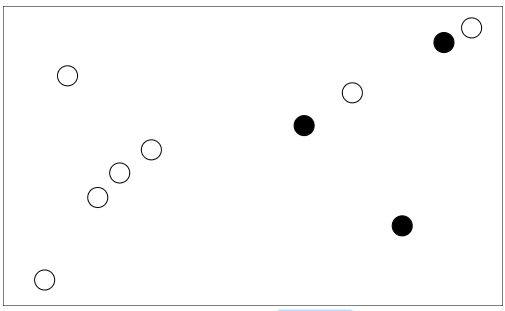
  
  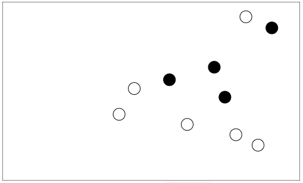
  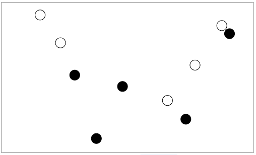
  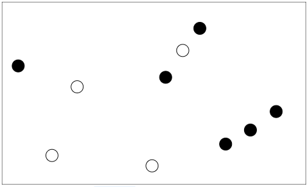
  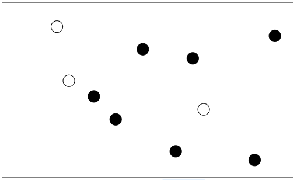
  
  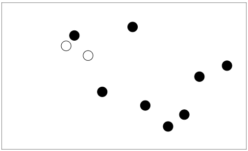
  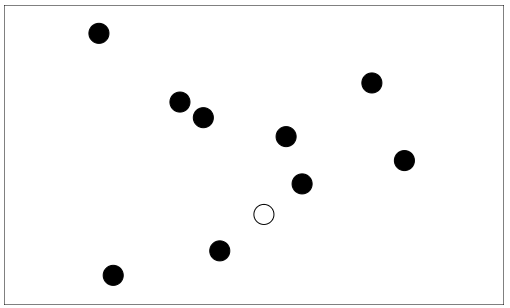
  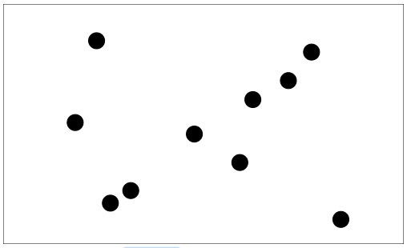
</div>

## rating scale task

<div align = 'center'>
  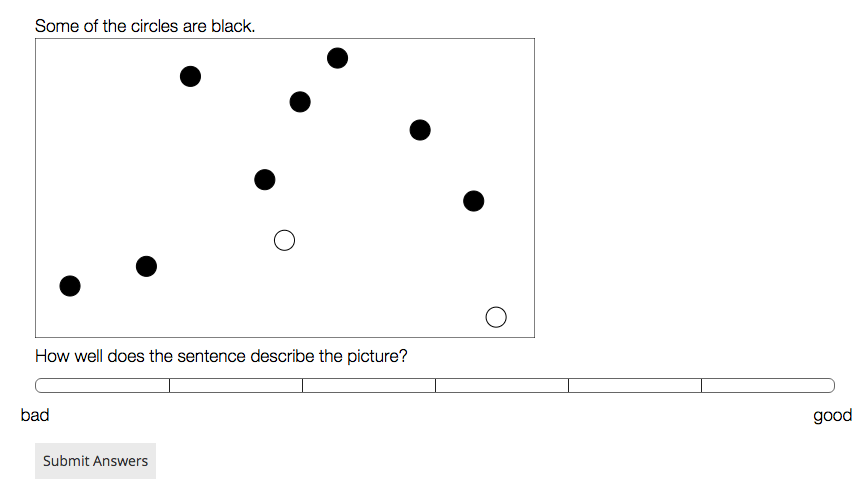
</div>

## design

- replication/extension of previous work
    - van Tiel & Geurts (2014), van Tiel (2014), Degen & Tanenhaus (2015)
- 4 experimental variants:
    - binary truth-value judgements vs. 7-point rating scale
    - include filler sentences with $\textit{many}$ and $\textit{most}$ or not
- participants recruited via Amazon's Mechanical Turk
    - each subject rated 3 sentences with <span style = "font-style: italic">some</span>
    - pseudo-randomized order; fully randomized visual displays

<span style = "color:white"> dummy </span>

<div align = 'center'>
  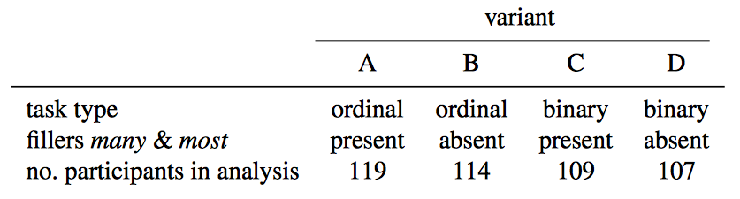
</div>

# data wrangling

## read data

```{r, message = T}
d = readr::read_csv('../data/00_typicality_some.csv') # from package 'readr'
```

## inspect data

```{r}
d
```

## any comments?

```{r}
levels(factor(d$comments))[1:20]
```


## self-reported native languages

```{r}
table(d$language)
```

## filter non-native speakers of Enblush

```{r}
d = dplyr::filter(d, ! language %in% c("FRENCH", "Japanese", "Russian", "Spanish", "Tamil", "white"))
table(d$language)
```


## select relevant columns & rows

```{r}
d = d %>% dplyr::filter(type == "some") %>% 
          dplyr::select(-language, -comments, -type)
d
```

## more intelligible column names

```{r}
d = d %>% dplyr::rename(condition = nr_black)
d
```

## adding columns

```{r}
d = d %>% dplyr::mutate(dependent.measure = ifelse(variant %in% c("A", "B"), "ordinal", "binary"),
                        alternatives = factor(ifelse(variant %in% c("A", "C"), "present", "absent"))) %>% 
          dplyr::select(- variant)
d
```

## rescale responses

```{r}
d = d %>% mutate(response = purrr::map2_dbl(dependent.measure, response, 
                                            function(x,y) { ifelse(x == "ordinal", (y-1)/6, y) } ))
d
```


## get mean RTs for dependent measures

```{r}
d %>% dplyr::group_by(dependent.measure) %>% 
      dplyr::summarize(mean.response = mean(response))
```


## get mean responses

```{r}
resp.summary = d %>% dplyr::group_by(dependent.measure, alternatives, condition) %>% 
                     dplyr::summarize(mean.response = mean(response))
resp.summary
```

# data visualization

## a naked plot

```{r}
ggplot()
```

## plotting mean responses

```{r}
ggplot(data = resp.summary, aes(x = condition, y = mean.response)) +
  geom_point()
```

## plotting mean responses per treatment

```{r}
ggplot(data = resp.summary, aes(x = condition, y = mean.response, color = alternatives)) +
  geom_point()
```

## plotting mean responses per treatment & depentend measure

```{r}
ggplot(data = resp.summary, aes(x = condition, y = mean.response, color = alternatives)) +
  geom_point() + geom_line() + facet_grid( . ~ dependent.measure)
```

## some cosmetics

```{r}
ggplot(data = resp.summary, aes(x = condition, y = mean.response, color = alternatives)) +
  geom_point() + geom_line() + facet_grid( . ~ dependent.measure) + 
  xlab("number of black balls") + ylab("mean response") +
  scale_x_continuous(breaks = 0:10) + scale_color_manual(values = c("darkgrey", "firebrick"))
```

# fini

## homework

<span style = "color:white"> &nbsp; </span>

- dive into [R for Data Science](http://r4ds.had.co.nz)

<span style = "color:white"> &nbsp; </span>

- extend your implementation of the (cat) picture rating task in the following way:
    - each time the experiment starts the participant is allocated at random to either a 2-button forced choice task or a slider rating task
        - you can find different response measures implemented in the [ResponseTypeTemplate](https://github.com/babe-project/ResponseTypeTemplate)
    - in the 2-button forced choice task, everything stays as it is
    - in the slider rating task, participants see all of your lovely pictures but rate them on a slider scale rather than make a forced choice