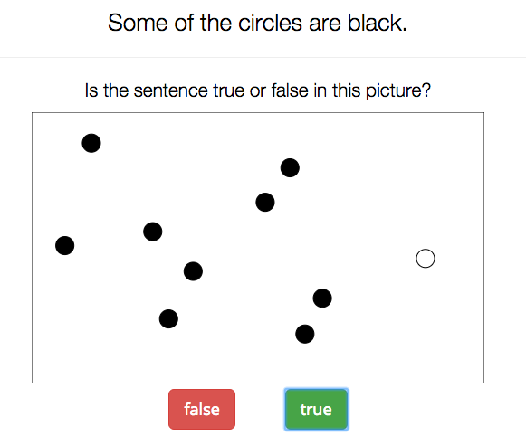

```{r setup, include=FALSE, echo = FALSE, message = FALSE}
knitr::opts_chunk$set(echo=TRUE, warning=FALSE, message=FALSE, dev.args = list(bg = 'transparent'), fig.align='center')
require('tidyverse')
theme_set(theme_bw() + theme(plot.background=element_blank()) )
```

## road map for today

<span style = "color:white"> &nbsp; </span>

- project suggestions

<span style = "color:white"> &nbsp; </span>

- Canvas functions

<span style = "color:white"> &nbsp; </span>

- Rmarkdown
    
<span style = "color:white"> &nbsp; </span>

- APA guidelines 

<span style = "color:white"> &nbsp; </span>

- practical exercises with R

# Canvas

## Job: extend your experiment

- instead of pictures (of cats etc.), use automatically generated pictures of
  colored shapes, like these:
  
  <div align = 'center'>
  
  </div>
  
- do **not** generate pictures manually beforehand, but generate a
  random picture on each trial

## Job description

- concretely, on each trial:
	- sample `total_set_size` from {10,25,50} and a non-zero `focal_set_size` of at most `total_set_size`
	- choose a random `shape` from {circle, square, triangle}
	- display `focal_set_size` of `shape` in the `focal_color`, the rest
      in the `other_color` (choose colors from {blue, red, yellow, green})
	- arrange colored shapes arbitrarily on the screen
	- dynamically construct the sentence to be judged/rated as: "Some of the `shape`s are `focal_color`."
	- record all relevant random choices for each trial's picture

## Canvas template

- obtain from: [https://github.com/babe-project/CanvasTemplate](https://github.com/babe-project/CanvasTemplate)

- in `index.html`:

```{HTML}
<div class="stimulus-container">
	<canvas id="canvas" height="400" width="600"></canvas>
</div>
```

- in `helpers.js`:

```{javascript}
var drawOnCanvas = function(canvasElem, trialInfo) {
    var canvas = createCanvas(document.getElementById('canvas')); // defined in scripts/canvas.js
    var coords = canvas.getCoords(trialInfo.total, trialInfo.size);
    for (var i=0; i<trialInfo.total; i++) {
        if (i < trialInfo.focalNumber) {
            canvas.draw(trialInfo.focalShape, trialInfo.size, coords[i].x, coords[i].y, trialInfo.focalColor);
        } else {
            canvas.draw(trialInfo.otherShape, trialInfo.size, coords[i].x, coords[i].y, trialInfo.otherColor);
        }
    }
};
```

- in `views.js`:

```{javascript}
drawOnCanvas(document.getElementById('canvas'), exp.trial_info.main_trials[CT]);
```


# Rmarkdown

## Rmarkdown: overview

- lean markup language which allows execution of R code
    - documentation: [https://rmarkdown.rstudio.com](https://rmarkdown.rstudio.com)
- exports to multiple formats
    - simplifies a reproducible work flow

<div align = 'center'>
  
</div>

# How to report an experiment

## APA guidelines to structure experiment reports (roughly)

- (optional) **motivation/design** 
    - say what kind of experiment this is (e.g., between vs. within-subject design)
    - explain motivation for the particular choice (often clear from introduction or preceeding context)
    
- **participants**
    - how many participants were recruited how/from where; gender distribution; age; payment etc.

- **materials & apparatus**
    - which pictures/sentences/instructions/machinery was used (e.g., which eye-tracker, ...)

- (optional) **analysis** (also sometimes referred to as 'design')
    - what are the dependent and independent variables used for statistical analysis

- (optional) **data preparation**
    - what you did to the data before you started statistical analyses, e.g., data cleaning, variable transformation
    
- **results**
    - summary statistics (e.g., mean error rates), plots & analyses (e.g., $p$-values)

- **discussion**
    - interpret the results
    
